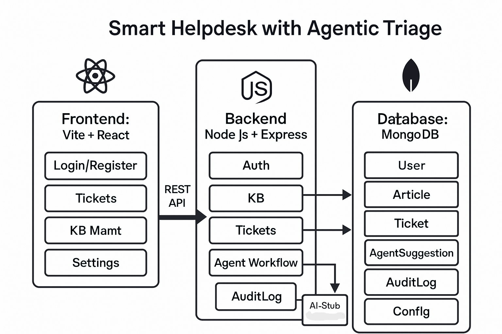

# Wexa Smart Helpdesk

## Overview

Wexa Smart Helpdesk is a full-stack MERN web application with agentic triage. Users can raise support tickets, which are automatically triaged by an AI workflow that classifies, searches the knowledge base, drafts a reply with references, and either auto-resolves the ticket or assigns it to a human support agent. Admins control KB articles and agent thresholds. The stack uses Vite + React for the frontend and Node.js + Express + MongoDB for the backend, following strict security, observability, and devops guidelines.

***

## Architecture



- **Frontend:** Vite + React + React Router + Zustand/Redux
  - Role-based UI: End User, Support Agent, Admin
  - Pages: Login/Register, KB List+Editor (Admin), Ticket List, Ticket Detail (Conversation, Agent Suggestion, Audit Log Timeline), Settings
  - API calls via Axios with JWT auth

- **Backend:** Node.js 20+ + Express + Mongoose  
  - REST endpoints: /api/auth, /api/kb, /api/tickets, /api/agent, /api/config, /api/audit
  - Agentic workflow: deterministic stub (no API key needed) runs on ticket creation to classify, search, draft, and decide ticket status
  - Secure middleware: input validation, RBAC, rate limiting, logging, healthz, readyz

- **Database:** MongoDB (Models: User, Article, Ticket, AgentSuggestion, AuditLog, Config)
  - Optional: Redis + BullMQ for agent job queue

- **DevOps:** Docker Compose for full stack spin-up; seed script for demo data; clear environment separation; health and readiness endpoints

- **Observability:** Structured logs with traceId/ticketId; audit log for every agentic step

### Environment Variables (`.env` example)

```
PORT=8080
MONGO_URI=mongodb://localhost:27017/helpdesk
JWT_SECRET=your_secret_here
AUTO_CLOSE_ENABLED=true
CONFIDENCE_THRESHOLD=0.78
STUB_MODE=true
OPENAI_API_KEY=   # leave blank unless using OpenAI
```

### Installation and Running Locally

```bash
git clone https://github.com/YOUR_USERNAME/wexa-smart-helpdesk.git
cd wexa-smart-helpdesk

# Backend setup
cd backend
cp .env.example .env         # Or create .env from above
npm install
node scripts/seed.js         # Seeds sample users, KB, tickets
npm run dev                  # or npm start

# (In a new terminal)
# Frontend setup
cd ../frontend
npm install
npm run dev

# Open http://localhost:5173 (or http://localhost:3000 if using Docker)
```

### One-Command Full Stack (Docker Compose)

```bash
docker compose up --build
# Then seed the DB inside the backend container:
docker exec -it wexa-backend sh -lc "node scripts/seed.js"
```

***

## How Agent Works

When a user creates a ticket:
1. **Classify:** Assigns category (billing, tech, shipping, other) based on keywords, with confidence. (Stub: keywords in description)
2. **Knowledge Base Search:** Retrieves top 3 published KB articles (simple regex/keyword search).
3. **Draft Reply:** Composes a template reply referencing those KB articles.
4. **Decision:** If auto-close enabled & confidence ≥ threshold, the agent closes the ticket with the draft reply. Otherwise, assigns to human agent.
5. **Audit Logging:** Every workflow step is logged with a consistent traceId viewable in the ticket audit timeline.

**Stub logic example:**
- Keywords like "refund", "invoice" → billing
- "error", "bug", "stack" → tech
- "delivery", "shipment", "package", "tracking" → shipping
- Confidence = number of matching keywords × 0.2 + 0.3 (max 0.95)
- Draft reply: "Thanks for reaching out. Please review: [KB articles]."

***

## API Reference

| Endpoint                | Method | Roles         | Description                                      |
|-------------------------|--------|--------------|--------------------------------------------------|
| /api/auth/register      | POST   | Public        | Register new user (returns JWT token)            |
| /api/auth/login         | POST   | Public        | Login (returns JWT token)                        |
| /api/kb                 | GET    | Auth (any)    | Search published KB articles                     |
| /api/kb                 | POST   | Admin         | Create KB article                                |
| /api/kb/:id             | PUT    | Admin         | Update KB article                                |
| /api/kb/:id             | DELETE | Admin         | Delete KB article                                |
| /api/tickets            | GET    | User/Agent    | Get tickets (filter by user / status)            |
| /api/tickets            | POST   | User          | Create a support ticket                          |
| /api/tickets/:id        | GET    | User/Agent    | Get ticket details                               |
| /api/tickets/:id/reply  | POST   | Agent/Admin   | Agent sends reply, updates status                |
| /api/tickets/:id/assign | POST   | Agent/Admin   | Assign agent to ticket                           |
| /api/agent/suggestion/:ticketId | GET | User/Agent | Get agent suggestion for ticket                  |
| /api/config             | GET/PUT| Admin         | Get/update config (autoclose, confidence, sla)   |
| /api/tickets/:id/audit  | GET    | User/Agent    | Get audit log for a ticket                       |

***

## Testing

- **Backend:** 5+ Jest/Vitest tests covering: authentication, KB search, ticket creation, agent triage workflow and audit logging.
- **Frontend:** 3+ Vitest/RTL tests for rendering and forms (e.g., login, ticket create, validation).
- **How to run tests:**

```bash
# Backend
cd backend
npm test     # or npx jest

# Frontend
cd frontend
npm test     # or npx vitest
```

- Example test coverage: Auth success/failure, public/private ticket views, auto-close logic, audit log steps, KB search matches.

***

## Deployment Guide

### Frontend (Vercel or Netlify)
- Import repository into Vercel (select `/frontend` as root, `npm run build`, output `dist`)
- Set environment variable: `VITE_API_URL=https://YOUR_BACKEND_URL`

### Backend (Render or Railway)
- Import repository, set up as Web Service with `/backend` as root.
- Add all necessary environment variables (MONGO_URI to Atlas, JWT_SECRET, etc).
- MongoDB: Use MongoDB Atlas Free Tier. Replace localhost with remote URI.
- Expose `/healthz` endpoint for health checks.

### Seeding in Production
- Use shell access or a Render job to run: `node scripts/seed.js`

***

## Live Demo - Publicly Accessible

🌐 **The application is now live and accessible worldwide!**

### Demo Credentials
- **End User:** `user@helpdesk.com` / `user123`
- **Support Agent:** `agent@helpdesk.com` / `agent123`  
- **Admin:** `admin@helpdesk.com` / `admin123`

### Key Features Available:
- **Role-Based Access Control:** Different interfaces for Users, Agents, and Admins
- **AI-Powered Ticket Triage:** Automatic classification and intelligent response suggestions
- **Knowledge Base Management:** Searchable articles with admin controls
- **Complete Audit Trails:** Full activity logging and transparency
- **Real-time Updates:** Live ticket status and suggestion updates

### User Flow Demo:
1. **Admin** logs in and manages KB articles
2. **End User** registers/logs in and creates support tickets
3. **AI Agent** automatically processes tickets with classification and suggestions
4. **Support Agents** can view AI suggestions and manage ticket responses
5. **Complete audit trail** visible for all ticket activities

**🚀 Live Application:** https://ppl-ai-code-interpreter-files.s3.amazonaws.com/web/direct-files/e33524121d27dd517f5dc4b9e8293bdd/efad572c-a2d2-4316-a313-844bd007abe2/index.html

***

## Technical Implementation
## Demo

🎥 [Watch Demo](https://drive.google.com/file/d/1snFjoG4QBoE7cwxK7DqtMkLshXMfT8YP/view?usp=drive_link)

***

*The application demonstrates enterprise-grade helpdesk functionality with intelligent AI assistance. For production deployment with persistent data, follow the deployment guide above to set up MongoDB Atlas and cloud hosting.*
