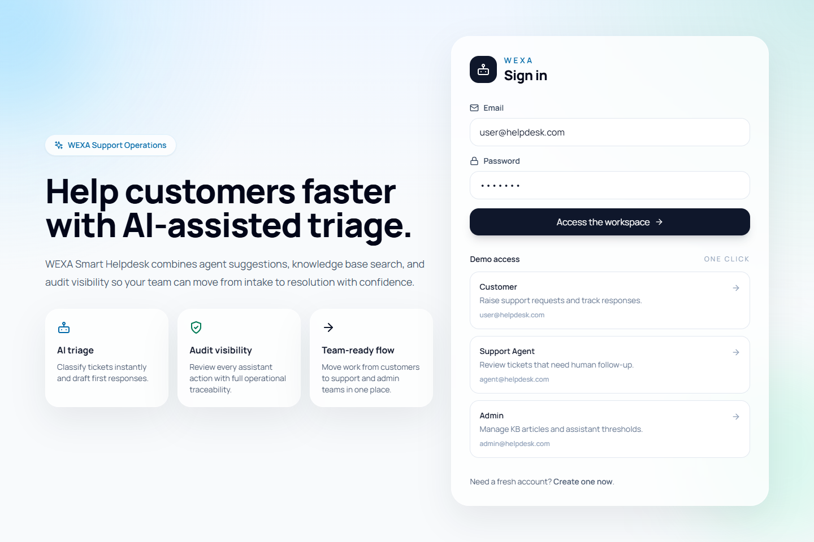
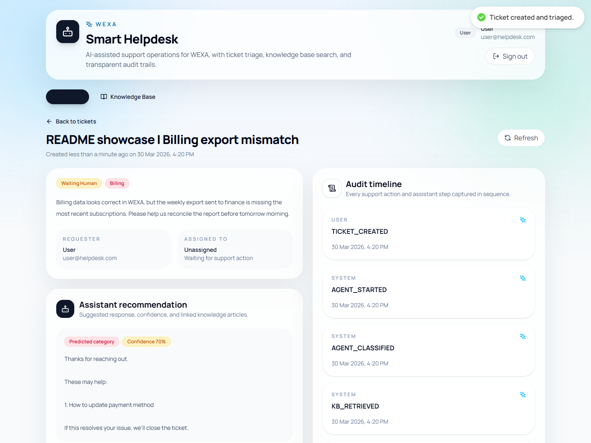
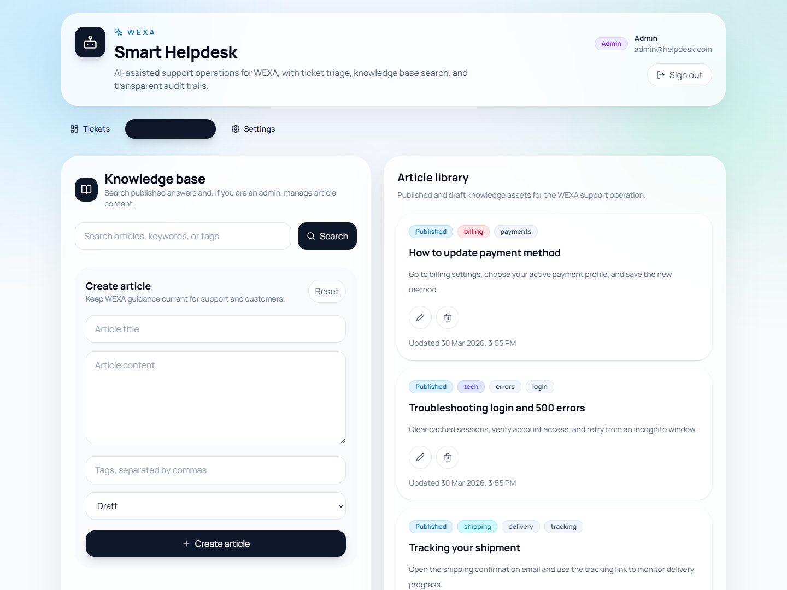
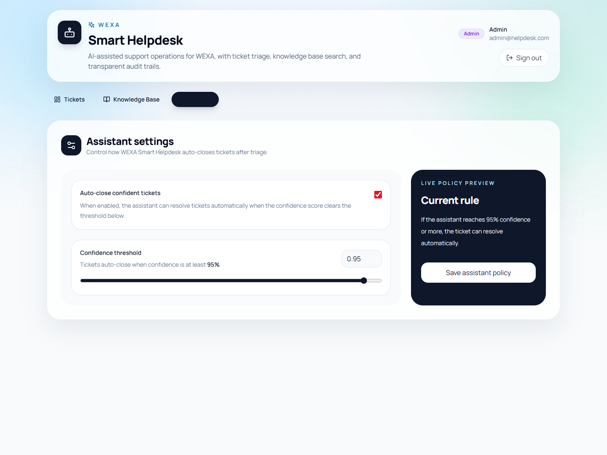
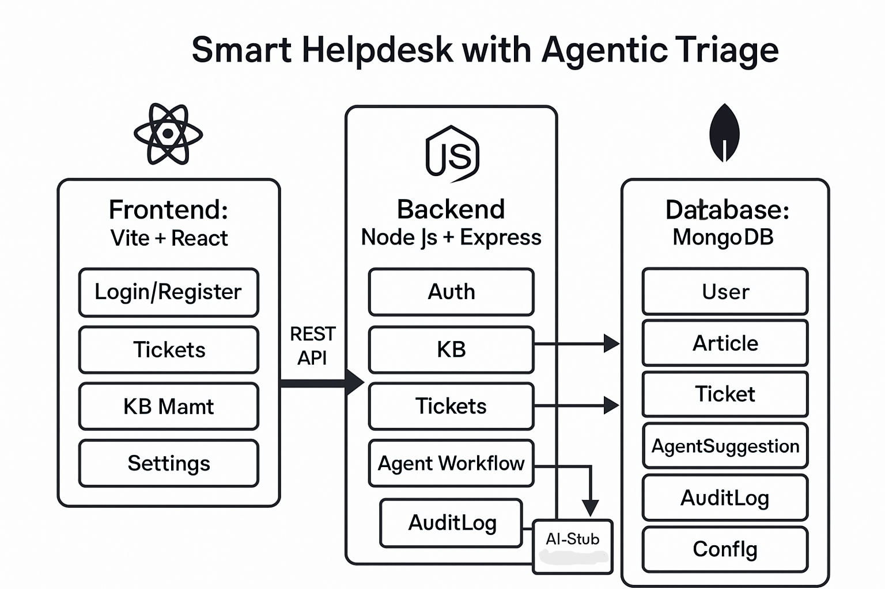

# WEXA Smart Helpdesk

WEXA Smart Helpdesk is a full-stack support operations platform built for WEXA. It combines AI-assisted ticket triage, role-based workflows, a searchable knowledge base, and an audit trail so support teams can move from intake to resolution with more clarity and speed.

[](https://wexa-smart-helpdesk.vercel.app)


[](https://render.com/deploy?repo=https://github.com/Sudhith11/wexa-smart-helpdesk)

## Why This Project Stands Out

- Designed as a company-ready support console instead of a toy CRUD dashboard
- Uses AI-style ticket classification and suggestion flows with visible confidence scoring
- Includes separate customer, agent, and admin experiences
- Ships with a polished WEXA-branded interface, seeded demo accounts, and starter knowledge content
- Supports both persistent MongoDB deployments and local development fallback modes

## Product Tour

| Sign In | Ticket Detail |
| --- | --- |
|  |  |

| Knowledge Base | Assistant Policy |
| --- | --- |
|  |  |

## Core Experience

### Customer Flow

- Sign in and create a support request
- Let the assistant classify the issue and draft a response
- Review the resulting ticket timeline, linked knowledge, and status

### Support Flow

- See the shared operations queue
- Jump into tickets that need human review
- Use the audit trail to understand what the assistant already did

### Admin Flow

- Manage knowledge base content
- Tune the auto-close threshold
- Control how aggressive the assistant should be in resolving tickets automatically

## Architecture



## Tech Stack

### Frontend

- React 18
- Vite 7
- React Router
- Zustand
- Tailwind CSS 4
- Axios
- Lucide React

### Backend

- Node.js
- Express 5
- Mongoose
- JWT authentication
- bcryptjs
- Jest
- Supertest

### Data and Operations

- MongoDB Atlas for persistent cloud storage
- In-memory MongoDB fallback for local or offline development
- GitHub for source control
- Vercel for frontend hosting
- Render blueprint for backend deployment

## Demo Accounts

The backend bootstraps these accounts automatically when the database is empty:

- Customer: `user@helpdesk.com` / `user123`
- Support agent: `agent@helpdesk.com` / `agent123`
- Admin: `admin@helpdesk.com` / `admin123`

## Local Development

### Software To Install

- Node.js 20+
- npm
- Git
- MongoDB Atlas account if you want persistent cloud data

### 1. Clone the repository

```bash
git clone https://github.com/Sudhith11/wexa-smart-helpdesk.git
cd wexa-smart-helpdesk
```

### 2. Configure environment files

Create these files from the included examples:

- `backend/.env` from `backend/.env.example`
- `frontend/.env` from `frontend/.env.example`

Backend example:

```env
PORT=8080
MONGO_URI=mongodb://localhost:27017/wexahelpdesk
JWT_SECRET=replace-with-a-strong-secret
STUB_MODE=true
ALLOW_DB_FALLBACK=true
CORS_ORIGIN=http://localhost:5173,http://localhost:3000
USE_IN_MEMORY_DB=false
OPENAI_API_KEY=
```

Frontend example:

```env
VITE_API_URL=http://localhost:8080/api
```

### 3. Install dependencies

```bash
cd backend
npm install
```

```bash
cd ../frontend
npm install
```

### 4. Run the backend

From `backend/`:

```bash
npm start
```

Expected output:

```text
Mongo connected
API on 8080
```

If Atlas is unavailable during local development, the app can still run with the in-memory fallback.

### 5. Run the frontend

From `frontend/`:

```bash
npm run dev
```

Open [http://localhost:5173](http://localhost:5173).

## Deployment Setup

### Frontend on Vercel

The frontend is already configured for Vercel in `frontend/vercel.json`.

- Framework: Vite
- Root directory: `frontend`
- Production behavior: `/api/*` requests are proxied to the Render backend
- Frontend auto-deploys when you push changes to GitHub

### Backend on Render

The repo now includes a Render Blueprint at `render.yaml`.

- Service name: `wexa-smart-helpdesk-api`
- Runtime: Node
- Root directory: `backend`
- Build command: `npm install`
- Start command: `npm start`
- Health check: `/healthz`
- `JWT_SECRET` is generated automatically by Render
- `MONGO_URI` stays unsynced so you can set your own MongoDB Atlas connection securely

Important:

- The production proxy in `frontend/vercel.json` expects the Render backend URL to be `https://wexa-smart-helpdesk-api.onrender.com`
- If Render gives you a different service URL, update `frontend/vercel.json` and redeploy the Vercel frontend

## Quality Checks

Frontend:

```bash
cd frontend
npm run lint
npm run build
```

Backend:

```bash
cd backend
npm test
```

## Docker

You can also run the stack with Docker Compose:

```bash
docker compose up --build
```

Services:

- Frontend: `http://localhost:3000`
- Backend: `http://localhost:8080`
- MongoDB: `mongodb://localhost:27017`

## API Surface

### Auth

- `POST /api/auth/register`
- `POST /api/auth/login`
- `GET /api/auth/me`

### Tickets

- `GET /api/tickets`
- `POST /api/tickets`
- `GET /api/tickets/:id`
- `GET /api/tickets/:id/audit`
- `POST /api/tickets/:id/reply`
- `POST /api/tickets/:id/assign`

### Knowledge Base

- `GET /api/kb`
- `POST /api/kb`
- `PUT /api/kb/:id`
- `DELETE /api/kb/:id`

### Assistant Controls

- `GET /api/agent/suggestion/:ticketId`
- `GET /api/agent/config`
- `PUT /api/agent/config`

## Notes

- Real secrets should stay in local `.env` files or hosting platform environment settings
- If you deploy on Render with a different subdomain, update the Vercel API rewrite destination accordingly
- The app seeds default users, starter KB articles, and assistant settings automatically on an empty database
